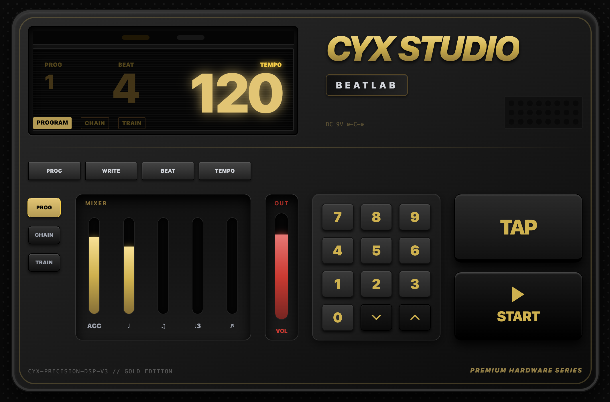

# 🎛️ CYX Studio | Beatlab Premium Metronome

> **High-Precision Digital Metronome with Premium Hardware UI.**
>
> 結合高階實體硬體質感與現代 Web Audio DSP 技術的專業數位節拍器。

🔗 [**Live Demo: 點此體驗 Beatlab (需輸入專屬 Access Code)**](https://cyx-studio-beat-lab-private.vercel.app/)

## ✨ 核心特色 (Features)
* **頂級硬體視覺設計 (Premium Hardware UI)**
  採用消光黑底色、金屬拉絲與發光琥珀金 (Amber Gold) 的 OLED 顯示風格，並支援完全的 RWD 手機橫向響應式體驗。
* **Web Audio 核心引擎**
  底層採用精準的 Web Audio API 進行音訊排程 (Lookahead Scheduling)，徹底解決傳統 `setInterval` 帶來的節拍誤差問題。
* **DSP 響度增強模組 (Loudness Boost)**
  內建 `DynamicsCompressorNode`，動態壓縮與提升總輸出響度，確保在手機揚聲器上也能獲得極具穿透力的節拍聲。
* **硬體級五軌混音器 (5-Track Mixer)**
  可獨立調整重音 (Accent)、四分音符、八分音符、三連音與十六分音符的音量。
* **Tap Tempo 演算法**
  即時分析連續點擊間距，動態推算平均 BPM。
* **40 組記憶區塊 (Memory Slots)**
  自動記憶使用者在不同 Program 下的 BPM 與拍號設定。
* **前端安全防護機制**
  搭載「PIN Code 硬體密碼鎖」存取控制，避免未經授權的存取。

## 📸 介面預覽 (Screenshots)

## 🛠️ 技術堆疊 (Tech Stack)
* **Frontend**: React (Hooks: `useState`, `useEffect`, `useRef`, `useCallback`)
* **Styling**: Tailwind CSS (CSS Pattern, Complex Gradients, Box Shadows)
* **Audio Engine**: HTML5 Web Audio API (Oscillator, GainNode, DynamicsCompressorNode)
* **Deployment**: Vercel / PWA Supported (Progressive Web App)

## 🔒 關於原始碼 (About Source Code)
> **Note:** To protect intellectual property and the core DSP engine, the complete source code of this project is maintained in a **Private Repository**. The purpose of this repository is to showcase the architecture, UI design, and technical capabilities of the project.
>
> 為了保護專案智財權與核心音訊引擎邏輯，本專案的完整程式碼存放於私有儲存庫中。此公開儲存庫僅作為作品集展示用途。
*Designed & Developed by [ＣＹＸ/CYX Studio]*
